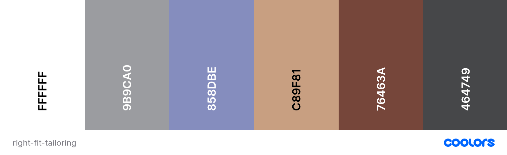

# Right Fit Tailoring

Right Fit Tailoring is a full service bespoke tailoring company that offers ready made men's fashion items and accessories as well as made to measure and alteration services. This application is their online store that customers can use to buy items, order made to measure and purchase alteration services. The deployed site can be viewed [here](#)

## Table of Contents
1. [UX](#ux)
    - [User Stories](#user-stories)
    - [Design](#design)
    - [Wireframes](#wireframes)
2. [Features](#features)
3. [Technologies Used](#technologies-used)
4. [Testing](#testing)
5. [Deployment](#deployment)
6. [Credits](#credits)
    - [Content](#content)
    - [Acknowledgements](#acknowledgements)

## UX

### User Stories
User stories regarding the application in general:
  - As a new user, I want to -
    - have a clear idea of what the site sells or does
    - easily navigate the site and any information within it
    - be able to easily add and remove items from the shopping cart
    - easily understand what measurements are needed for the 'made to measure' service
    - see the shopping cart total at all times
    - be confident that I can checkout securely
    - register for an account
    - be able to contact the site owner/administrator with any queries

User stories regarding the profile application:
  - As a registered user, I want to -
    - save my delivery information for future use, and edit when necessary
    - save my measurements for future use, and edit when necessary
    - see my previous orders
    - be able to add items to a wish list so I can come back to them later
    - be able to delete my account and all personal details if necessary

User stories relating to the owner:
  - As the site owner/administrator, I want to -
    - add new items to the site
    - edit and remove items that are already on the site
    - add discounts or deals to items or groups of items
    - view orders such that they can be easily fulfilled

### Design
This application is an e-commerce store utilising the [Django](https://www.djangoproject.com/) framework for functionality, and [Stripe](https://stripe.com/) for payment processing. The site is useable by both registered and unregistered users, with certain features only available to registered users. For those who register, there is a profile page where the user can view their default contact and delivery details along with their order history, and an application where they can add items to a wish list and save that list to be viewed later. This is also where the user can view and alter their default measurements for the made to measure service. It is possible to have multiple wish lists for each registered user.

The font families used for the application are Cinzel for the logo, Oswald for all headings, Josefin Sans for main body text, and Italianno for decorative text. All fonts have been sourced from [Google Fonts](https://fonts.google.com/).

The palette was generated by [coolors](https://coolors.co/) and are as follows:

### Wireframes
Below are the wireframes used to design the layout. They were created using [Balsamiq](https://balsamiq.com/)
  - [Home page](docs/wireframes/1_home.png)
  - [Log in/Register](docs/wireframes/2_login_register.png)
  - [Profile](docs/wireframes/3_profile.png)
  - [All Products](docs/wireframes/4_all_products.png)
  - [Shopping Cart](docs/wireframes/5_shopping_cart.png)
  - [Checkout](docs/wireframes/6_checkout.png)
  - [Made To Measure](docs/wireframes/7_made_to_measure.png)
  - [Made to Measure Form](docs/wireframes/8_mtm_form.png)
  - [Alterations](docs/wireframes/9_alterations.png)
  - [Wish List](docs/wireframes/10_wishlist.png)
  - [Contact](docs/wireframes/11_contact.png)

Back to [Table of Contents](#table-of-contents)

### Database
Below is the link to a tabulated view of how the data is stored in the database. The tables' columns have the displayed field name, the programmatic field name, the type of field that they are and any validation. All fields have validation of `null=False, blank=False` unless stated otherwise.

[database schema](docs/docs/database_schema.pdf)

## Features

### Future Features

## Technologies Used
### Languages:
  - [HTML5](https://en.wikipedia.org/wiki/HTML5)
    - This is the main mark-up language for the project
  - [CSS3](https://en.wikipedia.org/wiki/CSS)
    - Used for personalised styling over and above the Bootstrap styles
  - [JavaScript](https://en.wikipedia.org/wiki/JavaScript)
    - Used to animate and control aspects of the pages that move
  - [Python](https://www.python.org/)
    - Used to connect the frontend application to the backend database, and to control the navigation and publication of the application
  - [Jinja](https://jinja.palletsprojects.com/en/3.0.x/)
    - A templating language/engine used to simplify the page layouts and insert data from the database

### Libraries and Frameworks:
  - [Google Fonts](https://fonts.google.com/)
    - Used as the source for the font databases used in this site
  - [Font Awesome 5.15.3](https://fontawesome.com/)
    - Used as the source for the icons used
  - [Bootstrap 4.6](https://getbootstrap.com/docs/4.6/getting-started/introduction/)
    - The main CSS library used to style the pages and make it responsive
  - [Django](https://www.djangoproject.com/)
    - A full stack framework used facilitate the production of the application

### Tools:
  - [Atom](https://atom.io/) with [GitHub Desktop](https://desktop.github.com/)
    - Atom is my preferred text editor, linked with GitHub Desktop in order to push the code to GitHub
  - [Git](https://git-scm.com/)
    - Used for version control
  - [GitHub](https://github.com/)
    - Used to store the project files
  - [Balsamiq](https://balsamiq.com/)
    - A wireframe program used to create the mock-ups
  - [Coolors](https://coolors.co/)
    - An online tool to create colour palettes

Back to [Table of Contents](#table-of-contents)

## Testing

I have gathered all my testing data, and stored it in a separate file, which can be found [here](TESTING.md)

### Known Bugs

## Deployment
### Heroku
Deployment for this project is via [Heroku](https://www.heroku.com).
1. Create a requirements.txt file by typing pip3 freeze --local > requirements.txt in your repository terminal
2. Create a Procfile so that Heroku knows how to run the app. Do this by typing echo web: python app.py into your repositories terminal
3. Make sure these files have been pushed to the GitHub repository and then navigate to [Heroku](https://www.heroku.com)
4. Log in and select 'new' in the top right, name your app and choose a region that is closest to you. The app name must be unique.
5. On the dashboard for your app, select the 'Deploy' tab and under deployment method, select GitHub (the easiest option if your repository is in GitHub)
6. Enter the repository name underneath that and hit search. select the repository by clicking 'Connect'
7. You can either select Automatic or Manual deployment depending on your method. This project has been deployed with the manual method. Remember that if you choose manual, then every time the main/master branch is changed, you will need to re-deploy the app.
8. Next, go to the 'Settings' tab and select 'Reveal Config Vars'
9. Here you need to add several KEY: VALUE pairs for the app to run. They are
  - I.P: 0.0.0.0
  - PORT: 5000
  - MONGO_DBNAME: *database name*
  - MONGO_URI: *MongoDB URI, taken from the connections section of the database*
  - SECRET_KEY: *secret key of your choice*
10. Once these KEY: VALUE pairs have been added, the app will be reachable from the [Heroku](https://www.heroku.com) portal

### Forking the Repository
If you would like to view/change the code for the project then you can copy this repository to your GitHub account by forking it. You will then be able to do this without affecting the original repository:
1. From the repository home page,  click the 'fork' button (just below your picture with the dropdown menu)
2. You should now have a copy of the repository on your account

### Making a Local Clone
1. From the repository home page, select the 'code' tab (next to the green 'Gitpod' button)
2. To clone the repository using HTTPS, under "Clone with HTTPS", copy the link.
3. Open Git Bash
4. Change the current working directory to the location where you want the cloned directory to be made.
5. Type 'git clone', and then paste the URL you copied in Step 2.
6. Press Enter. Your local clone will be created.
7. Alternatively, you can use 'Open with GitHub Desktop' and follow the instructions, or just download the ZIP file containing the code files

Click [Here](https://docs.github.com/en/github/creating-cloning-and-archiving-repositories/cloning-a-repository-from-github/cloning-a-repository#cloning-a-repository-to-github-desktop) to view the GitHub documentation on deployment, or [Here](https://devcenter.heroku.com/)for the Heroku documentation for further help and advice.

Back to [Table of Contents](#table-of-contents)

## Credits

### Content
  - All code was written by myself or taken from the materialize documentation (with one exception; see below), with inspiration taken from the Code Institute walkthrough projects

### Acknowledgements
  - Thanks to my mentor for help, guidance and support during this project as always
  - [Stack Overflow](https://stackoverflow.com/) - much like w3schools, an essential source of guidance...there is always someone who has had the same problem, and the answer is likely here
  - [Code Institute](https://codeinstitute.net/) - from inspiration through all the walkthrough projects to the tools needed to complete

Back to [Table of Contents](#table-of-contents)
