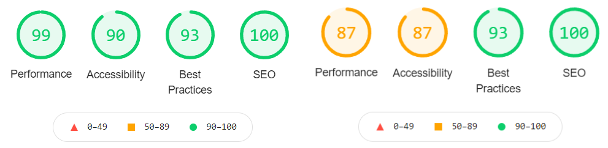
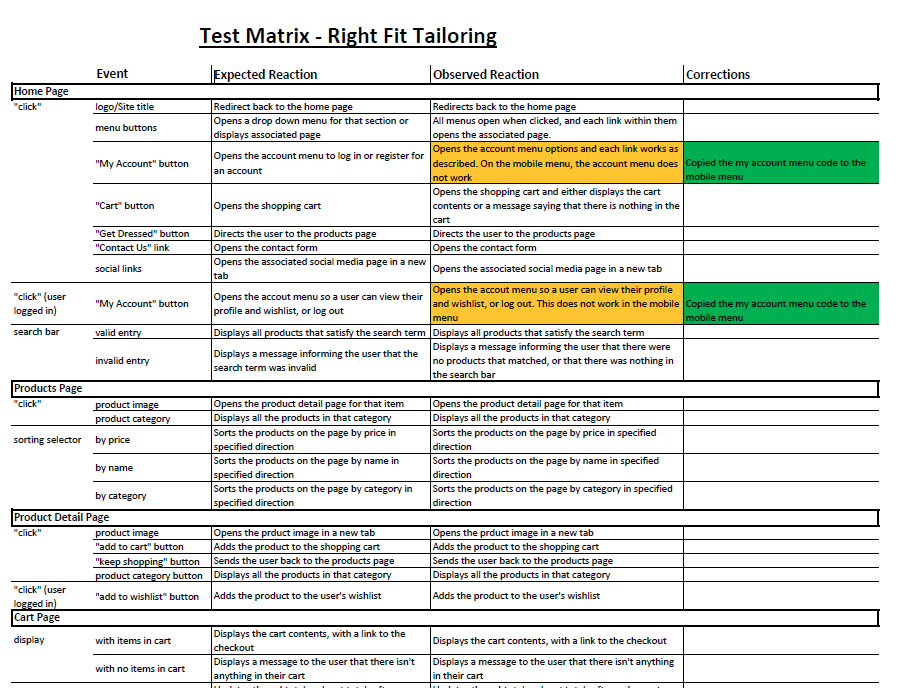

# Testing

This page contains all the stages that I went through to test this application and it's features.

You can return to the main README page [here](README.md)
## Table of Contents
1. [Code Validation](#code-validation)
    - [HTML](#html)
    - [CSS](#css)
    - [JavaScript](#javascript)
    - [Python](#python)
2. [Responsiveness](#responsiveness)
3. [Performance](#performance)
4. [Objective Testing](#objective-testing)
5. [User Story Evaluation](#user-story-evaluation)

## Code Validation

### HTML
The HTML code was passed through the [W3C Markup Validation Service](https://validator.w3.org/). Minor changes were made such as removing a `
` tag as a child of a `<button>` tag, and removing unnecessary attributes. The changes made can be seen in commit [#504bbca](https://github.com/tealhorizon87/ms4_right-fit-tailoring/commit/504bbcae80fcfcd6f24d601106054cc6036e8aa1).

### CSS
The CSS files were passed through the [W3C CSS Validation Service](https://jigsaw.w3.org/css-validator/). No errors or warnings were found.

### JavaScript
The JavaScript file was copied into [JSLint](https://www.jslint.com/) for error checking. No errors were found.

### Python
The python code was copied into [PEP8 online](http://pep8online.com/) for error checking. Minor issues were fixed, such as line length and line spacing. The changes made can be seen in commit [#d872a0a](https://github.com/tealhorizon87/ms4_right-fit-tailoring/commit/d872a0a3e5738e9b1283c35af105cd6cac785bee).

## Responsiveness

This application was built using [Bootstrap 4.6](https://getbootstrap.com/docs/4.6/getting-started/introduction/) and as such, responsiveness was inherent within the design. All pages are displayed correctly on all screen sizes without compromising the content of the page.

## Performance

### Lighthouse
Lighthouse was used to assess the performance of the page. This was done for both desktop and mobile versions. All pages returned similar values as these that were from the home page (desktop/mobile):

Those items that were not passed, such as text contrast in the search bar, are considered acceptable issues, or issues involving externally linked pages.

### Cross-Browser Compatibility
The link for the site was uploaded to [BrowserStack](https://www.browserstack.com/). The site was then loaded using multiple browsers, and all worked exactly as expected.

Back to [Table of Contents](#table-of-contents)

## Objective Testing

Due to time constraints on this project, unit testing was not possible. However, I have endeavoured to check all the functionality through objective testing according to the below test matrix:

The full table can be found [here](docs/docs/test-matrix.pdf).

Any faults that were found have either been corrected or added to the 'known bugs' section in the README.

The user authentication section has not been tested in this project as it has come directly from Django allauth and will have been thoroughly tested before release. Similarly. Stripe functionality has been tested in so much that orders are processed, caught by the webhooks, and stored in a correct manner. 

Back to [Table of Contents](#table-of-contents)

## User Story Evaluation

Finally, to make sure that the goals set out at the beginning of the project have been met, the user stories were evaluated:

General User Stories:
  - As a user, I want to -
    - have a clear idea of what the site sells or does
      - __A large header and hero image with slogan should make it reasonably obvious what the site is for__
    - easily navigate the site and any information within it
      - __All links and buttons are labelled is a way that should make it easy for the user to find their way around the site__
    - see the shopping cart total at all times
      - __The cart logo in the top right is always displayed and has the cart total displayed underneath it__
    - register for an account
      - __A new user can access the register page from the account menu__
  - As the site owner/administrator, I want to -
    - add new items to the site
      - __At the moment, the only way to add or adjust products is to access the django admin page. A product admin section is one of the items in the 'future features' section in the README__
    - edit and remove items that are already on the site
      - __See above__
    - add discounts or deals to items or groups of items
      - __As with the above two items, this function is available in the django admin page, and will be added with the future product admin section__
    - view orders such that they can be easily fulfilled
      - __All 'ready to wear' and 'made to measure' orders are registered in the admin page. In production, these can be sent to internal order fulfilment departments__

Shopping Cart app user stories:
  - As a user, I want to -
  	- be able to easily add and remove items from the shopping cart
      - __The user can add items to the cart from the product detail page and wish list. Any item can be removed from the cart by the 'remove' button on each item__
  	- see the shopping cart total at all times
      - __The cart total is always displayed in the top right with the cart icon__
  	- see a breakdown of costs for each item in the cart before the checkout
      - __Each item has a unit price and a subtotal__
  	- see if there is an extra charge for delivery, and be told how to reduce it
      - __At the moment, there is no delivery charge involved with this site__
  	- have the option to go back to the store if I'm not ready to checkout
      - __There is a button to return the cart from the checkout page, and then a button to return to the products from the cart page__

Checkout add user stories:
  - As a user, I want to -
    - be confident that I can checkout securely
      - __This is always a worry. In all honesty, there could be more evidence on the site about who processes the payment, and give the user an option to use PayPal and Apple Pay. This will be added at a later date__
    - clearly see what will be charged before submitting the form
      - __There is a total order cost displayed on the checkout page__
    - be able to save my details for future use if registered
      - __If the user is logged in, they can check the box below the payment form and their details will be saved__

Profile app user stories:
  - As a registered user, I want to -
    - save my delivery information for future use, and edit when necessary
      - __Any details the user wishes to store in the site can be done on the profile page. This data is then used to pre-fill the checkout's payment form__
    - save my measurements for future use, and edit when necessary
      - __At the moment, this is not currently available. This will be added to a future version of the site__
    - see my previous orders
      - __There is a section of the profile page that can display previous orders__
    - be able to delete my account and all personal details if necessary
      - __At the moment there is not a 'delete profile' button. This will be added in a future version of the site__

Wish list app user stories:
  - As a registered user, I want to -
    - be able to add and remove items to a wish list
      - __You can add items to the wish list from the product detail page, and remove them with the remove button on each item in the wish list__
    - be able to have more than one wish list at a time
      - __This is not currently possible, and while it would be a useful feature, it is not something that will be developed for this site at the moment__
    - be able to add items to the shopping cart directly from the wish list
      - __Each product in the wish list is displayed as a mini 'product detail' page. you can specify the quantity and size of each item in the wish list and add them to the shopping cart__

Back to [Table of Contents](#table-of-contents)
